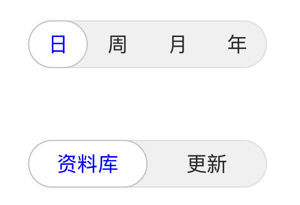

# 自定义SegmentControl（CustomSegmentControl）


## 背景

iOS提供的控件UISegmentControl可以通过setBackgroundImage、setDividerImage等改变控件的外观。但在处理圆角和按下状态时效果不太理想，所以实现了一个自定义控件，它继承UIButton,使用方法和系统UISegmentControl类似，支持点击和拖动。

## 使用方法

### 引入工程
将文件CustomSegmentControl.h,CustomSegmentControl.m两个文件拷贝到工程中，在需要引用的地方

```
#import "CustomSegmentControl.h"
```

### 实例化控件对象
```
CustomSegmentControl* segment = [[CustomSegmentControl alloc] initWithItems:@[@"日", @"周", @"月", @"年"]];
segment.frame = CGRectMake(80, 100, 200, 40);    [segment addTarget:self action:@selector(segmentValueChanged:) forControlEvents:UIControlEventValueChanged];
segment.selectedIndex = 0;

/*自定义背景图片
  segment.normalImage = [[UIImage imageNamed:@"mySegCtrl-normal-bkgd"] resizableImageWithCapInsets:UIEdgeInsetsMake(2, 20, 2, 20) resizingMode:UIImageResizingModeStretch];
  segment.selectedImage = [[UIImage imageNamed:@"mySegCtrl-selected-bkgd"] resizableImageWithCapInsets:UIEdgeInsetsMake(2, 20, 2, 20) resizingMode:UIImageResizingModeStretch];
 */
     
[self.view addSubview:segment];
    
segment = [[CustomSegmentControl alloc] initWithItems:@[@"资料库", @"更新"]];
segment.frame = CGRectMake(80, 200, 200, 40);
segment.selectedIndex = 0;
[self.view addSubview:segment];
```

### 控件效果
